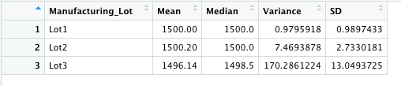
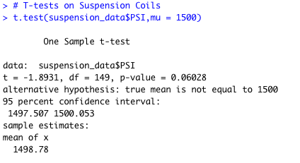

# MechaCar_Statistical_Analysis
AutosRUs’ wants the data analytics team to review the production data for insights that may help the manufacturing team.

### Overview
- In this project, statistics and hypothesis testing is used to analyze a series of datasets from the automotive industry using R programming language.
- In order to conduct this analysis, I am using two datsets containing information related to the miles per gallon and the suspension coils of the MechaCar. 
- Along with the programming language R, its dplyr library is used to complete this analysis.

## Linear Regression to Predict MPG 
- In this section, I loaded in the MechaCar mpg dataset (miles per gallon dataset. From there, I preformed a multiple linear regression to see if it could predict the miles per gallon (mpg) dependent variable by using the vehicle length, vehicle weight, spoiler angle, ground clearance, and all wheel drive (AWD) independent variables. By doing this, I wanted to answer three questions:

 1. Which variables/coefficients provided a non-random amount of variance to the mpg values in the dataset?
 2. Is the slope of the linear model considered to be zero? Why or why not?
 3. Does this linear model predict mpg of MechaCar prototypes effectively? Why or why not?

- The answers to these questions are:

1. There were two variables that provided a non-random amount of variance: The vehicle length and the ground_clearance. Both of these have extremely small p-value meaning that they had a high level of significance. It also should be noted that the intercept as had a high level of significance meaning that there are still other factors contributing to the variance of the miles per gallon of the MechaCar.
2. The slope of the linear model is not considered to be zero. This is because the linear regression shows that some of the independent variables had a significant effect on the dependent variable. If none of the independent variables had an effect on the dependent variable then the linear regression would result in a near zero slope.
3. The main indicator of whether the linear model predicts the mpg of the MechaCar is the r-squared value. In this case, it is at 0.7149 mean that out of 100 instances, this model would approximately predict the mpg of the MechaCar correctly 71 times. This means that the model would be considered effective.

### Below are the summary results from the MIles Per Gallon (mpg) linear regression:

## Summary Statistics on Suspension Coils
In this section, I loaded in the suspension coils dataset.
- It was comprised of 150 different vehicles ID, 3 different lot numbers, and corresponding PSI levels for each vehicle.
- I created two summary tables to look at the mean, median, variance, and standard deviation of data.
- The first table (Total Summary) looked at of the data as a whole.
  
  
- The second table (Lot Summary) looked specific at each of the three different lots that the MechaCars were divided into. 
  
  
  
 - By completing this analysis the design specifications for the MechaCar suspension coils dictates that the variance of the suspension coils must not exceed 100 pounds per square inch. 
 
### Does the current manufacturing data meet this design specification for all manufacturing lots in total and each lot individually? Why or why not?
- The answer to this question is:
    1. Looking at the total summary, the current variance is approximately 76.23 PSI meaning that is does meet the design specification. 
    2. When looking at the lots individuals, the first two lots meet the design specification at a varaince of approximately 1.14 PSI and 10.13 PSI respectfully,       but the third lot does not. 
    3. This is becasue the third lot's variance is approximately 220.01 PSI, exceeding the design specification by more than double the alotted amount. 
    4. Therefore, the manufacturing team should work with the cars in lots 1 and 2 compared to those in lot 3.

## T-Test on Suspension Coils

- In this section, I wanted to determine if all manufacturing lots and each lot individually are statistically different from the population mean of 1,500 pounds   per square inch. In order to do this, I used R's t.test() function to find four different p-values. 

### Do any of the four groups have a statistically different mean from the population of 1,500 PSI?
- The answer to this question is:

By using a significance level of 95%, meaning that 95% of the time this tests results would be true, I tested to see if any of the four groups had a      statistical difference from the mean of 1,500 PSI. After running the tests, all four p-values where much greater than .05 meaning that I would fail to reject that there is a statistical difference between the four groups and the population mean.

Below is a breakdown of each of the four tests:

## Study Design: MechaCar vs Competition
In this section, I am comparing how the MechaCar performs with the competition. I am not preforming any tests in R, I am talking about how I would go about completing this analysis. In order to do this I want to answer four different questions which are:

1. What metric or metrics are you going to test?
2. What is the null hypothesis or alternative hypothesis?
3. What statistical test would you use to test the hypothesis? And why?
4. What data is needed to run the statistical test?
  
The answer to these questions are:

1. The metrics I want to test are city and highway fuel efficiencies.
2. Null Hypothesis is that all of the cars in the same class have the same fuel efficienies. THe Alternative Hypothesis is that they are not all the same.
3. I would use an ANOVA test to complete this analysis for both types of fuel efficiencies. Also I would use the ggplot2 library to show the potential spread     between different cars using a boxplot.
4. I would need fuel efficiency data from 50 individual cars to create a sample size of data for each car in the class type. For example, if there was 10 cars   in the class type, I would have a top of 500 data points collected for each fuel efficiency type.

